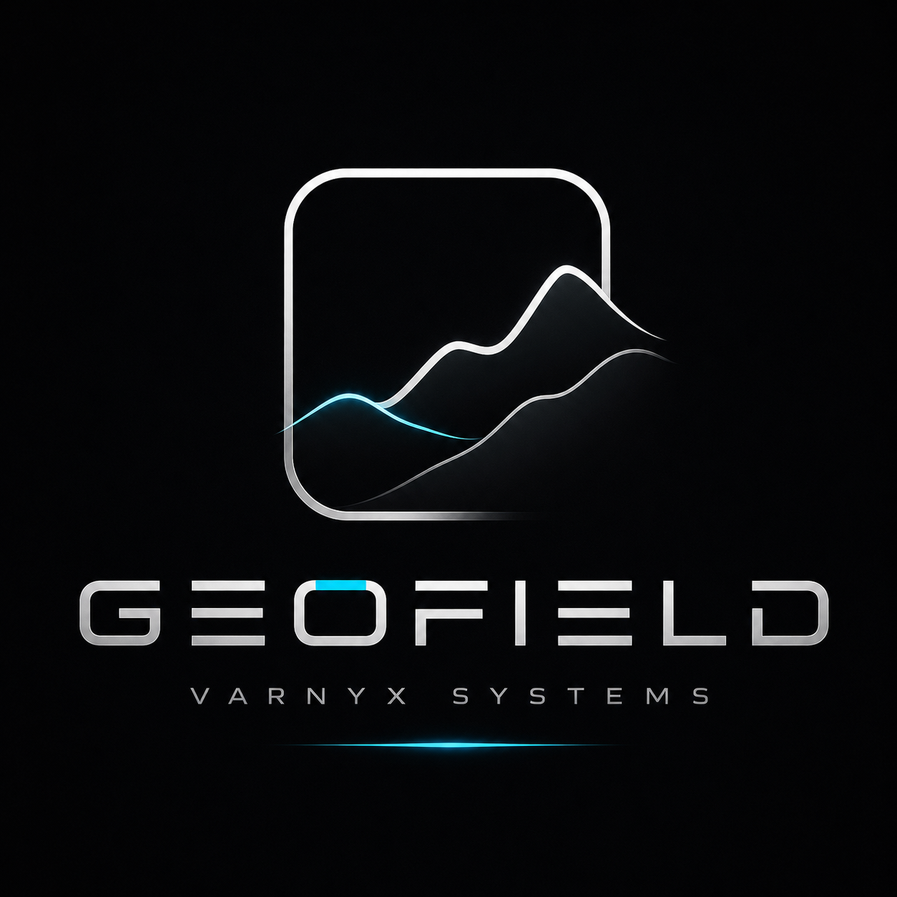
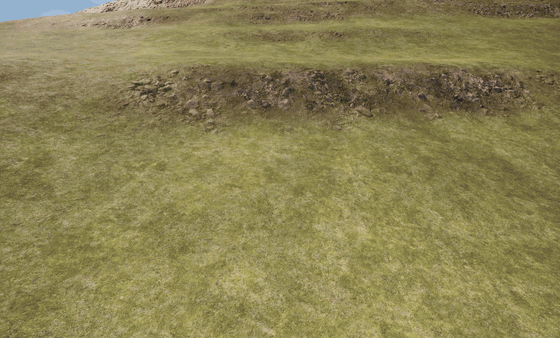
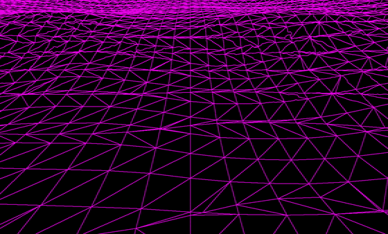
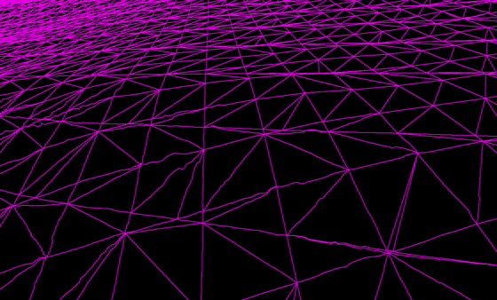
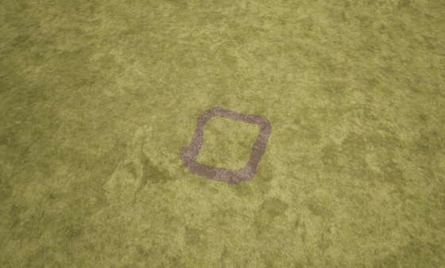
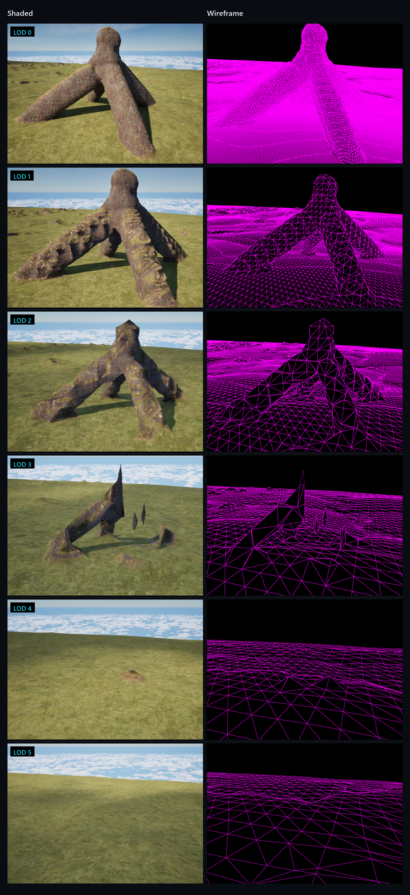
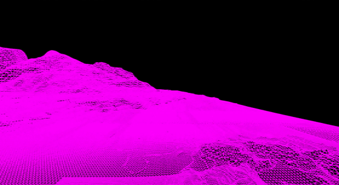
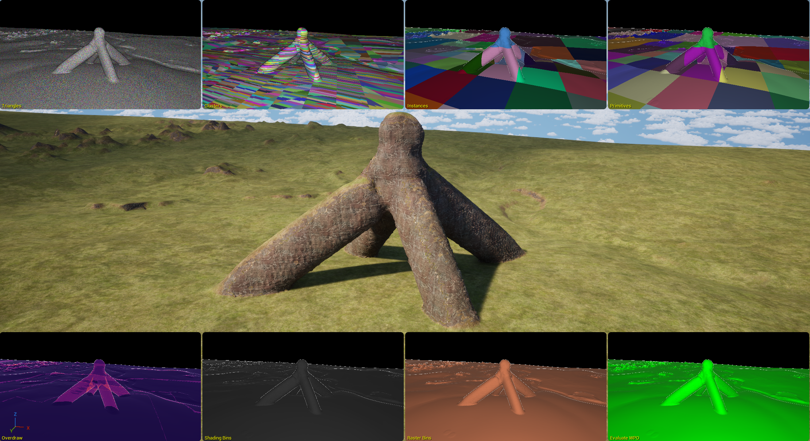

**A plugin for everything your world is made of**

## Overview

GeoField replaces Unreal's heightmap terrain with a volumetric one. Sculpt it, dig through it,
paint it, in the Editor or at runtime, and the world responds in the same frame.

There is only ever one copy of the world. The SDF is the truth, and every system is built on it
rather than keeping its own version: Nanite [draws](#nanite-encoder) it, Lumen
[lights](#distance-fields) it, Chaos collides with it. Water, biomes and vegetation are still
ahead, and they will be built the same way, so a world made in GeoField stays one thing instead
of several systems held together by hand.

Call it a voxel terrain if you like. The field stores signed distances rather than blocks, so
surfaces come out smooth rather than stepped.

## Sculpting

Raise, lower, dig, smooth and flatten, with adjustable brush radius, strength and step rate. A
stroke is a swept volume rather than a series of stamps, so a fast drag leaves no gaps.

Edits are written into the field, never into a mesh. Only the [chunks](#chunks) the brush
intersects are rebuilt, and the rest of the world is never revisited.

Subtracting writes to the [samples](#bricks) inside the brush, so the work follows the brush
and not the size of the world. Cells that sat inside the volume carried no triangles a moment
earlier. Now they carry the cavity.

## Painting

> [!NOTE]
> **This part is being reworked.** Painting currently writes into the layer set of the
> terrain material. It is moving onto its own surface assets: you define a paintable
> surface once, with its base colour, normal, height and displacement maps, assign it to
> GeoField and paint with it. That makes painting independent of how the terrain material
> is built, so a classic Landscape layer material, the newer mesh terrain layering and a
> plain material graph all behave the same way.

Surfaces are painted straight onto the field, and several can meet on a single
[chunk](#chunks).

Where each surface belongs is decided by your material, not by GeoField. It writes what you
painted and nothing else.

## Level of detail

Detail is an [octree](#octree) of cubes that subdivides on all three axes. Vertical structure
costs what it should: a cave system or a floating island is no more expensive than the ground
beside it, and empty space is not stored at all.

Levels resolve as the camera moves. [Transitions](#seams) between adjacent levels are generated
into the mesh rather than patched afterwards, and a node holds one state and switches once, so
there is no permanent transition and no flicker. The distance at which each level takes over is
yours to set, so detail and cost can be traded for the content you actually have.

## Nanite

Geometry is encoded for [Nanite](#nanite-encoder) directly, without an intermediate static mesh
asset. Displacement materials are supported.

## Performance

Measured on a 4 x 4 km world at 0.5 m cell size, in Unreal Engine 5.8 under D3D12, on an AMD
Ryzen 9 5950X with 16 cores, an NVIDIA RTX 3080 Ti and 64 GB of memory. Your world, your
content and your hardware will move these numbers.

| | |
| :-- | :-- |
| **Building the world** | The whole 4 x 4 km map is visible after **0.1 s**, and fine terrain with collision around the player is standing in **under 2 seconds** |
| **Flying at 48 m/s over fresh terrain** | **1 of 16 CPU cores** on average, 27 worker threads at the peak, and not one frame over 16.6 ms across 25 seconds |
| **Standing still** | **0.01 cores.** The terrain system is doing nothing |
| **Memory at rest** | **62 MB** for the entire world, because only the [shell around the surface](#bricks) is stored |
| **Memory in steady play** | 131 MB in use, plus an optional 150 MB cache that trades memory for fewer rebuilds |
| **A terrain edit** | Visible and walkable on the **next frame** |
| **200 edits in 20 seconds** | **No dropped frame** |
| **Save file** | Your edits, not the world: 209 edits are **0.6 MB**, and the same world always writes the same bytes |

Terrain work runs on worker threads, which is why the figures above are CPU cores rather than
frame rate: a frame rate would hide work that never touched the game thread. The
[octree](#octree) is what keeps that work bounded, and the numbers for standing still are
not rounded down, they are what a settled tree costs.

## Features

| | |
| :-- | :-- |
| **[Sculpting](#sculpting)**   Raise, lower, dig, smooth and flatten, in the Editor and at runtime |  |
| **[Cutting](#sculpting)**   Caves, tunnels, overhangs and arches, because the field has no preferred axis |  |
| **[Painting](#painting)**   Surfaces painted into the field, driving your terrain material |  |
| **[Level of detail](#level-of-detail)**   [Octree](#octree) subdividing on all three axes, transitions built into the mesh |  |
| **[Rendering](#nanite)**   Direct [Nanite encoding](#nanite-encoder), with and without displacement materials |  |
| **Lighting**   [Distance fields](#distance-fields) generated from the same data Lumen reads |  |
| **Collision**   Chaos geometry rebuilt from the field on every edit |  |
| **Persistence**   Byte-stable save and reload, verified across machines and builds |  |
| **[Heightmap import](#field-sources)**   Heightmaps as Unreal assets, PNG and 16 bit raw |  |
| **Mesh import**   Morph any static mesh into the terrain and keep it editable |  |
| **Multiple sources**   Several [field sources](#field-sources) in one world, live and editable |  |
| **Editor mode**   A dedicated mode with sculpt, paint and object tabs |  |
| **Heightmap editor**   Compose a world from several heightmaps and apply it in one step |  |
| **PCG support**   Unreal's procedural graphs running on GeoField terrain |  |
| **Biome painting**   Forest, meadow and snow painted inside the heightmap editor |  |
| **Procedural placement**   Vegetation, rocks and roads driven by those biomes |  |
| **Water**   Ocean, rivers and flow that follows the terrain |  |
| **Deformable surfaces**   Mud and snow that retain tracks |  |
| **Erosion and hydrology**   Terrain shaped by the water running over it |  |
| **Landscape conversion**   Import an existing Unreal landscape as a source |  |

## Requirements

Unreal Engine 5 on Windows, in a project that can compile C++. GeoField ships as a C++ plugin
with a Blueprint-facing API. Using it does not require writing C++.

## Under the hood

### Field sources

The world is not stored as one finished volume. It is composed at read time from sources: a
heightmap carries the base shape, brush strokes are kept as their own layer above it, and
further sources join them as the system grows. Nothing is flattened into a baked result, so a
source can be moved, replaced or removed and the world is simply evaluated again around it.

Because the composition happens at read time, it is also resolution free. Changing the cell
size of a world does not re-import anything. The same recipe is simply evaluated at a different
spacing.

### Bricks

Samples live in bricks of 32 by 32 by 32 voxels, and only bricks the surface passes through are
stored at all. Each keeps a narrow band around the surface in half precision, so the cost of a
world follows the area of its surface rather than its volume: a cave adds surface in that
region and adds storage there, while the solid volume around it costs nothing.

### Chunks

A chunk is the unit GeoField meshes, draws and collides with, and it corresponds to one node of
the [octree](#octree). Edits, level changes and collision updates are all expressed in chunks,
which is why a brush stroke costs what it touches rather than what it is near.

### Octree

Nodes are cubes, and a node splits into eight children, so the tree subdivides in height
exactly as it does laterally. Neighbouring nodes are held within one level of each other, which
keeps the transition between them to a single case.

A cube that contains no surface is never created. That is what makes vertical structure
affordable: the empty air above the terrain and the solid volume below it both cost nothing,
and only the shell between them is carried.

Levels are chosen from the camera alone, with hysteresis entering and leaving each level, so a
node settles into one state instead of oscillating at a boundary. With the camera at rest the
tree performs no work at all.

Work also falls off with distance faster than area does. A node one level coarser covers eight
times the volume, so far fewer of them cover the same ground, and you have to travel the width
of a whole node before any of them needs to change. Most of the world is already correct most
of the time, and the near field is where the work stays.

### Seams

All [chunks](#chunks) sample one global lattice, so two neighbours read bit-identical values
along a shared face. Seams are not repaired after the fact, they never open, and the shipping
configuration carries no skirts.

### Nanite encoder

Nanite normally consumes geometry that was prepared offline: a static mesh asset is built into
clusters and pages ahead of time, and the runtime only draws the result. GeoField writes those
structures itself, so a [chunk](#chunks) that was meshed a moment ago is drawn by Nanite in the
same frame without ever becoming an asset.

That leaves two mechanisms working on different scales instead of competing. The
[octree](#octree) decides which chunk is drawn at which resolution, and Nanite decides how
much of that chunk to raster once it is on screen. The encoder carries no level of detail
semantics of its own.

### Distance fields

Lumen and distance field shadows read mesh distance fields, which Unreal normally bakes from
static meshes at cook time. GeoField already [stores the world](#bricks) as a distance field,
so producing one is a resampling rather than a computation, and it happens in the same pass
that rebuilds the geometry.

The consequence is that lighting keeps up with edits immediately.

## Why

I have always been drawn to landscapes in games that are efficient and interactive at the same
time, and that combination is what I kept missing in Unreal. So I set out to build it.

It started as the terrain for one game of mine. It has not stayed that way.

What mattered just as much was having one coherent workflow: shaping the land, painting it and
everything that follows in the same place, instead of a chain of tools that each stop where the
next one begins.

And you learn an enormous amount building something like this.

## References

GeoField is written from scratch. **No code from any of the projects below is part of it**, and
none of them is a dependency. They were read, measured against and argued with.

| | |
| :-- | :-- |
| **Transvoxel** (Eric Lengyel) | The structural idea behind seamless transitions between detail levels: a transition layer belonging to the coarser side, under a strict 2:1 rule. The published lookup tables are deliberately not used, because they bake ambiguous cases in permanently and could never agree bit for bit with a runtime decision |
| **Marching Cubes** (Lorensen and Cline, 1987) | The mesher the surface is extracted with |
| **godot_voxel** (Zylann, MIT) | Read for its LOD octree, its streaming and, just as usefully, the failure modes it documents in its own issue tracker |
| **Voxel Plugin** (Phyronnaz) | Read as the reference point in this niche, for its invoker model and its published container benchmarks |
| **Terrain3D**, **leven**, **building-blocks** | Read for how others solve level of detail, anchors and sparse storage |
| **Unreal Engine source** | Landscape, Nanite and World Partition, read to understand what the engine expects from a terrain rather than to guess at it |

GPL licensed sources were excluded from the outset, since the Unreal EULA and the GPL do not go
together.

## Future

The complete plugin will most likely be sold on Fab, though that is still some way off.

Core parts of the plugin will also be released as standalone open source components under
MPL-2.0. The sparse distance field storage, the meshing and the Nanite encoding are useful well
beyond terrain, and there is no good reason to keep them to myself.

A playable demo is planned for this repository.

## Contact

If you have questions, feel free to open an issue.

---

This repository contains documentation and media only. GeoField is a commercial plugin
and its source is not published here.

A <a href="https://github.com/VarnyxSystems">VARNYX Systems</a> plugin

